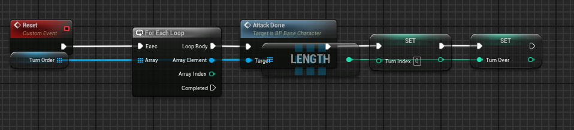

# Ben Powell Development Journal

### Time Keeping

>To help with time keeping for the project, i was recommended to use Trello to plan out the different sprints with parts of the game.
  I will still need to research into what good versions of these systems are in similiar games, as well as research how things with work or be done.

<iframe src = "https://trello.com/b/ckvr7f3T.html" frameBorder="0" width="50%" height="300"> </iframe>

> Attempting to get the trello board to embed into the markup to better show it off rather than using screen shots, however it has not seemd to work so far, even when going to different html sites. 
 
> After narrowing it down to the public/ private access of the board, i changed it to public and after seemingly it not working, it did and now embedds into the markdown file. I think it may have just taken a bit for the board to update to being public. (1)

Bibliography
(1)||262588213843476 (s.d.) Embed public Trello cards/boards. At: https://gist.github.com/moraDmp30/8ae9304e0c2ec149fa6ec7a4bcc6190b (Accessed  01/10/2024).

### Research
Design

I started to research different games such as autobattlers and rogue likes for system i could mimic or use.

 
For Super auto pets i liked the dual stats of the animals as that gave a simple but scalable statline to start with, as being able to make strats or items that only affect few parts can make the strategy layer even more deep.

 
I like the idea of the inventory equip screen if i go a more personal inventory route with the item equipping. The showcasing of the units stats and items etc is also nice as a bar is easier to see quickly, and will work for all types.

 
When i get round to doing the rogue like, decision elements, the sort of encounter where you can gain but with the risk of losing things, or even partial wounding etc, seems like good idea. 

 
I like the UI and the ability to control the units with their positioning and then external weapons to affect the gameplay. Im not if i want my player to have that much control over the combat but this is an area to look at the amount i want to have.

 
If i wanted to go for more complicated and rpg style stats for the characters, the for the king stats is one way to look. The inventory is also simple with the symbols, and could be a good, easy way of showcasing the inventory items that are equipped to the characters.

 
If i wanted to add a bit of chance to the game in the terms of the items given, rather than having set ones given out, i could have random items given out a certain times to choose from, that may have complimentary effects to the already got items, or make the user pivot to new strategies 

 
Peglin encounters are a bit more simple than other ones, but most of the time gives users the choice between options, and may also give a bit of risk for the better items. 
 
Slay the spire is one way i could lay out the characters on screen to see them easily and watch any combat. Having the units face eachother with the view being side on seems to be a usual for games like this, rather than the for the king viewing from behind.
 
Slice and dice is a more abstracted fighting system using dice rolls directly to give choices on what abilities happen. As well as turns being whole teams acting then the others.
 
After battle choices of getting money or healing is nice easy decision point, that can be made alongside the items, and the Sovl system is a good example of a lower detailed version.
 
The user upgrades also give simple but impactful choices and effects that while probably not all relevant some of them could be.
 
As a more complicated system, the large team, more free auto battling system of Team fight tactics is an interesting way of doing it. Although i think a lot of the draw for this is the cool graphics and links to an already exisiting game, so may not work as well for my game.
 
The inventory system of stacking items and combining them together is an interesting concept and something i could try and replicate.

MVP

For the minimun viable product i will need a combat system that automatically battles, but in a turn order one at a time. 
I will also need some sort of inventory system. 

Will need a base character class to create the different ones like the enemies and the player characters.

For the turn based combat i will need an initiative array to put the different characters in to determine order that the units will attack.
I will probably want to give an indication that a unit is attacking before using animations.

Set up the camera and mode settings

Created a base character to build upon.
Realised that a turn order could be difficult in how it would work.
either gather all the characters into a list and sort it by speed/ initiative. 
Or to make it avaliable to be affected during play, perhaps going through all the characters in the battle and find the current lowest in the initiative. and after the go add 20. (Make each combat 'phase' have 20 )

I got the sorting to work, and used some debug prints to figure out if it did.
It was adding an extra item in the index. Made it so that extra was at the end, and then removed it. This seemed to work but will have to look back at it.

Then i wanted to make the turn sequence. 

I put the sorting the turn order into its own event to play at the beiginning.
Then it will start the turns. 
Tried to use a for loop to go through the intiative list and trigger an attack for each one.
I tried to add a delay so that it wouldn't trigger ti all at once. But from what i can tell delays dont work very well for loops.
I might ask for advice on what to use, possibly using a state machine to go through it.
Im also getting an error.

I spoke with Assad about my issues using a for loop and he said i should look into data driven ECS to create a combat manager.

Upon having a rethink about how the combat manager.
Changed the sorting to the maangar and did it in a better way.

https://forums.unrealengine.com/t/find-actors-then-sort/445169/2

Waned to check what would happen if two of the characters had the same speeds.
Also created child classes of the basecharacter, one for the hero and one for the enemy, so that non shared functionality could be done.
Added functions on the battle manager to better organise the code and not have it all on the event graph
Created a damage calc and attack logic.
Because im using a loop to go through the turns, i cant use delays. So im figuring out how to use timers to trigger the functions instead.
Having more issue with putting delays in, so instead focusing on the damage.
The targetting and damaging was having issues, but turns out i had used the wrong lists.
Sometimes the text would not update even if the health had been taken off, and it would change the wrong one.
I move it to being a variable and it seemd to work.
To try and get the delay to work, i got the macro of the loop and copied it in, so to see if that works.
Still didnt work so using a manual go through rather than a loop might be the answer.
Still not really working, but repeating the combat event successfully continues. Will need to properly add logic to that, and have some sort of overall looping. 
Instead of using the for loop, which causes issues for delaying between the turns.
Using a button to trigger each movement, just so i can show it working. Used an event dispatcher, https://www.youtube.com/watch?v=5GYsTTcGGJo. To catch the keyboard press and then trigger the event in the battle manager.
Once ive got something going i may make more use of these.
It does go through the whole thing, now i need to make sure it doesnt do more than one thing while its 'moving' / an attack is going.
Checking whether the enemy is dead or the players are dead.
Added a UI.

Played it all the way through
Will go through each turn, once the enemy die, it show game over

Created a button that starts the round.
Made it so it will automatically go through the whole thing and stop when the enemy is dead.
Showed problems in the way i was resetting the positions of the units, as if the enemy died mid way through, it would still leave that one forward.
In adding a button widget, it complicated how i was doing the game over widget beforehand, so that stopped working and will have to figure out how to fix it.
Fixed the ending issue by saving the start location. Have a full reset capability.
Need to add some sort of inventory
As a base for the different widgets and menus etc, i made a menu manager to control the menu and widget use outside the battle manager.
i then realised the death screen only works properly when the first to die is the enemy, will need to do the check if all the good guys are dead.
 
I created the basis of the inventory system, as well as a Ui to allow it to be equiped. You can click the hero you want to equip and then the button affects the stats of the selected character.

I want to fix the starrt menus and equip so its more intuitive and works properly.
I also want it to set up properly, and will keep playing after you win or lose. So theres a complete experience. 

Realised that some of my buttons were on press rather than click, which could cause some issues if people dont unpressed the button. So will rectify that on all my buttons.
realised that it would still be looking for line trace when off the equip menus, and would cause issues if i then clicked on a character, while not in the equip screen. I set up a check to only do it while on that screen.
i also had to move the cursor showing to the new opening UI, which after some tests was requested as a better flow for the beginning of the game.

State machine to improve flow i next term?

After accidentally trying to use a decorator to get the items, and being an issue for scaling, i have opted to use a data table full of structs, with details about the items. 
To aid in this im going to create an item manager to control everything in a single place.
Using the item manager with the data tables means its easier to add new inventory items, and then also makes it largely scaleable to however many more items there will be.

Creating the re set up events, but hit snag with accesing the data table for the enemy data, as you coould only get it through the row name rather than an index. Instead i need to get the data out as a string and put it in an array of strings and get the index values from there. The use of a function library was suggested, which could be a good way to keep functions that have good possible use in multiple blueprints/ objects. I think i will use one as a test of using it.

Created the function library for setting the health, speed and damage. Might try use it to do the hero characters as well as the enemy. I also finished the logic for resetting with a new enemy, so much so that the game is able to be played after winning one round, until one of the heros die. I want to change it so that its until all of them die.
Also needed so they dont get targeted or attack if dead.

## Battle Manager
### Begin Play

This is the early set up and binding of events that come from event dispatchers.
It puts the ui on sreen.
It then leads onto setting up the enemy with the first set of stats.

### Enemy Set up

This goes to enemy character and sets its stats depending on the numbers in the table, that is full of a enemyStat Struct

It will then set the text of the character through the set text event set up in the base character.

### Set up 

This creates a array of the characters and sets up a turn order in the order of the characters speed value
### 

This resets the hero stats and redoes their tags to make them 'alive'

These functions sorts the characters, making use of a sorted list and swapping if not in the right place.

### Turn

This starts the turn, checking if the battle has been comeplete, to stop, and if there is a turn already in progress.

This then goes character by character, doing 'combat' and then going to the next character. and then triggering next turn again

the combat then triggers the attack logic

Which then triggers this function that triggers the show attack on the character and then triggers the damage calculation function 

This damage calculation function takes a target from the possible ones and takes from the health

This triggers after all the characters have attacked and puts them back in place ready to starts everything over.

This event is triggered when a character is dead, and checks whether it is the enemy or the heroes and triggers the game over screen when appropriate
## Menu Manager
The menu manager makes it easier to sort the viewport and menus in one place using event dispatches to trigger things based on what has been pressed.
Alot of the ui pass through the game mode blueprint as event dispatches as that was the easiest way i could think of to make it castable to bind the events elsewhere.
## Characters
#### Base character

This gets the start position of the character to use in the movement while attacking

This is the set text that is triggered in the battle manager

This checks whether the character is alive and will let the battle manager know if its dead.

This shows the attack by moving the actor

This then resets the position

#### Hero

This is a struct that saves the max values incase they get changed during the battle such as health
#### Enemy

This triggers if the enemy dies to let the battle manager know.

### Function library

I made a function library to have a stored area to access the functions for the data table incase i needed to use them more

## Items

This shows the way i set uo the clicking on the characters to then assign which one was being selected to equip the items.

This is then sent to the item manager.

Which takes the selected hero and saves it.

Which then takes the stats from the data table and then adds it to the stats of the character that has been selected.

## Reflection 
I definitely learned alot from this project, in terms of things i need to learn and keep on top of such as some more complicated unreal features like event dispatches and also different ways of structuring the project like using some what data oriented design and using managers rather than having everything be completely objects.
I wish i had been a bit more consistent with progress and working on the project, which is something i regret not doing and will try to do better as i work on it in the second term. 
I would like to have planned out the entire game and how the peices fit together a bit better from the beggining.
The project definitely helped me regain my confidence that i am decent at problem sovling and learning in unreal, which i was struggling a bit with the start.
I think the write up is something i can also improve on as i never know what to right in the time, and end up rushing it at the end.

## Bibliography
Teamfight Tactics (s.d.) At: https://teamfighttactics.leagueoflegends.com/en-gb/ (Accessed  06/12/2024).
For The King on Steam (s.d.) At: https://store.steampowered.com/app/527230/For_The_King/ (Accessed  06/12/2024).
Crying Suns on Steam (s.d.) At: https://store.steampowered.com/app/873940/Crying_Suns/ (Accessed  06/12/2024).
SOVL: Fantasy Warfare on Steam (s.d.) At: https://store.steampowered.com/app/1870300/SOVL_Fantasy_Warfare/ (Accessed  06/12/2024).
Super Auto Pets (s.d.) At: https://teamwoodgames.com/ (Accessed  06/12/2024).
Loopstructor on Steam (s.d.) At: https://store.steampowered.com/app/2726870/Loopstructor/ (Accessed  06/12/2024).
Peglin on Steam (s.d.) At: https://store.steampowered.com/app/1296610/Peglin/ (Accessed  06/12/2024).
Slice & Dice on Steam (s.d.) At: https://store.steampowered.com/app/1775490/Slice__Dice/ (Accessed  06/12/2024).
Slay the Spire on Steam (s.d.) At: https://store.steampowered.com/app/646570/Slay_the_Spire/ (Accessed  06/12/2024).
