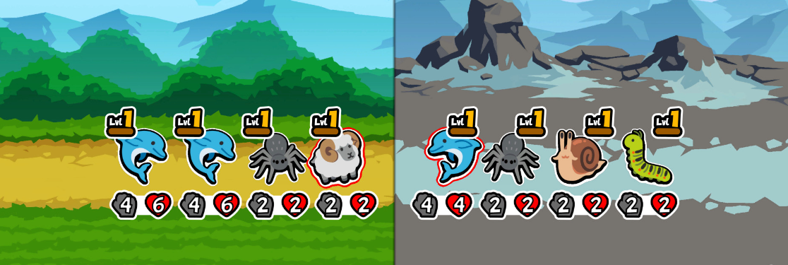

# Ben Powell Development Journal

### Time Keeping

>To help with time keeping for the project, i was recommended to use Trello to plan out the different sprints with parts of the game.
  I will still need to research into what good versions of these systems are in similiar games, as well as research how things with work or be done.

<iframe src = "https://trello.com/b/ckvr7f3T.html" frameBorder="0" width="50%" height="300"> </iframe>

> Attempting to get the trello board to embed into the markup to better show it off rather than using screen shots, however it has not seemd to work so far, even when going to different html sites. 
 
> After narrowing it down to the public/ private access of the board, i changed it to public and after seemingly it not working, it did and now embedds into the markdown file. I think it may have just taken a bit for the board to update to being public. (1)

Bibliography
(1)||262588213843476 (s.d.) Embed public Trello cards/boards. At: https://gist.github.com/moraDmp30/8ae9304e0c2ec149fa6ec7a4bcc6190b (Accessed  01/10/2024).

### Research
Design

I started to research different games such as autobattlers and rogue likes for system i could mimic or use.

 

 

 

 

 

 

 

 

 

 

 

 

 

MVP

For the minimun viable product i will need a combat system that automatically battles, but in a turn order one at a time. 
I will also need some sort of inventory system. 

Will need a base character class to create the different ones like the enemies and the player characters.

For the turn based combat i will need an initiative array to put the different characters in to determine order that the units will attack.
I will probably want to give an indication that a unit is attacking before using animations.

Set up the camera and mode settings

Created a base character to build upon.
Realised that a turn order could be difficult in how it would work.
either gather all the characters into a list and sort it by speed/ initiative. 
Or to make it avaliable to be affected during play, perhaps going through all the characters in the battle and find the current lowest in the initiative. and after the go add 20. (Make each combat 'phase' have 20 )

I got the sorting to work, and used some debug prints to figure out if it did.
It was adding an extra item in the index. Made it so that extra was at the end, and then removed it. This seemed to work but will have to look back at it.

Then i wanted to make the turn sequence. 

I put the sorting the turn order into its own event to play at the beiginning.
Then it will start the turns. 
Tried to use a for loop to go through the intiative list and trigger an attack for each one.
I tried to add a delay so that it wouldn't trigger ti all at once. But from what i can tell delays dont work very well for loops.
I might ask for advice on what to use, possibly using a state machine to go through it.
Im also getting an error.

I spoke with Assad about my issues using a for loop and he said i should look into data driven ECS to create a combat manager.

Upon having a rethink about how the combat manager.
Changed the sorting to the maangar and did it in a better way.

https://forums.unrealengine.com/t/find-actors-then-sort/445169/2

Waned to check what would happen if two of the characters had the same speeds.
Also created child classes of the basecharacter, one for the hero and one for the enemy, so that non shared functionality could be done.
Added functions on the battle manager to better organise the code and not have it all on the event graph
Created a damage calc and attack logic.
Because im using a loop to go through the turns, i cant use delays. So im figuring out how to use timers to trigger the functions instead.
Having more issue with putting delays in, so instead focusing on the damage.
The targetting and damaging was having issues, but turns out i had used the wrong lists.
Sometimes the text would not update even if the health had been taken off, and it would change the wrong one.
I move it to being a variable and it seemd to work.
To try and get the delay to work, i got the macro of the loop and copied it in, so to see if that works.
Still didnt work so using a manual go through rather than a loop might be the answer.
Still not really working, but repeating the combat event successfully continues. Will need to properly add logic to that, and have some sort of overall looping. 
Instead of using the for loop, which causes issues for delaying between the turns.
Using a button to trigger each movement, just so i can show it working. Used an event dispatcher, https://www.youtube.com/watch?v=5GYsTTcGGJo. To catch the keyboard press and then trigger the event in the battle manager.
Once ive got something going i may make more use of these.
It does go through the whole thing, now i need to make sure it doesnt do more than one thing while its 'moving' / an attack is going.
Checking whether the enemy is dead or the players are dead.
Added a UI.

Played it all the way through
Will go through each turn, once the enemy die, it show game over

Created a button that starts the round.
Made it so it will automatically go through the whole thing and stop when the enemy is dead.
Showed problems in the way i was resetting the positions of the units, as if the enemy died mid way through, it would still leave that one forward.
In adding a button widget, it complicated how i was doing the game over widget beforehand, so that stopped working and will have to figure out how to fix it.
Fixed the ending issue by saving the start location. Have a full reset capability.
Need to add some sort of inventory
As a base for the different widgets and menus etc, i made a menu manager to control the menu and widget use outside the battle manager.
i then realised the death screen only works properly when the first to die is the enemy, will need to do the check if all the good guys are dead.
 
I created the basis of the inventory system, as well as a Ui to allow it to be equiped. You can click the hero you want to equip and then the button affects the stats of the selected character.

I want to fix the starrt menus and equip so its more intuitive and works properly.
I also want it to set up properly, and will keep playing after you win or lose. So theres a complete experience. 

Realised that some of my buttons were on press rather than click, which could cause some issues if people dont unpressed the button. So will rectify that on all my buttons.
realised that it would still be looking for line trace when off the equip menus, and would cause issues if i then clicked on a character, while not in the equip screen. I set up a check to only do it while on that screen.
i also had to move the cursor showing to the new opening UI, which after some tests was requested as a better flow for the beginning of the game.

State machine to improve flow i next term?

After accidentally trying to use a decorator to get the items, and being an issue for scaling, i have opted to use a data table full of structs, with details about the items. 
To aid in this im going to create an item manager to control everything in a single place.
Using the item manager with the data tables means its easier to add new inventory items, and then also makes it largely scaleable to however many more items there will be.

Creating the re set up events, but hit snag with accesing the data table for the enemy data, as you coould only get it through the row name rather than an index. Instead i need to get the data out as a string and put it in an array of strings and get the index values from there. The use of a function library was suggested, which could be a good way to keep functions that have good possible use in multiple blueprints/ objects. I think i will use one as a test of using it.

Created the function library for setting the health, speed and damage. Might try use it to do the hero characters as well as the enemy. I also finished the logic for resetting with a new enemy, so much so that the game is able to be played after winning one round, until one of the heros die. I want to change it so that its until all of them die.
Also needed so they dont get targeted or attack if dead.