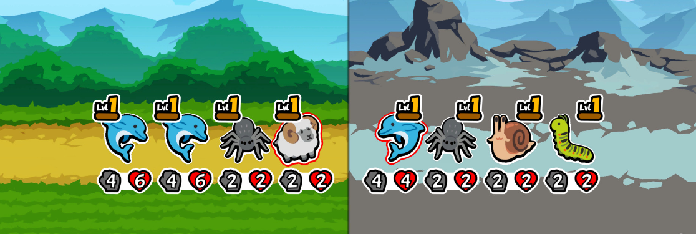

# 2204331 Ben Powell
# Ben Powell Project Commentary

### Planninng for term

 After using mostly blueprints for the prototype, i want to take the current state of the game and use it to practice C++ and specifcally Unreal C++, and as i already have things done in the project it will be easier than figuring it out from scratch. 

 To better figure out how to turn it from blueprints, to C++ i want to create a proper map of the workings of the project, so i can better see how the different parts and managers interact with each other. This will help me be able to fix or change things, and then also how to expand it from the current.

## Project Outcome

## Research
### Battle Styles
Turn based vs Real time

"idea behind TB systems is that each character has an array of actions
to choose from but can only perform a limited number of them per
turn, and hence players must make smart decisions regarding what
each of their characters do in combat"."(Mäkelä and Schmidt, 2020)

Mäkelä, V. and Schmidt, A. (2020) 'I Don’t Care as Long as It’s Good: Player Preferences for Real-Time and Turn-Based Combat Systems in Computer RPGs' In: Proceedings of the Annual Symposium on Computer-Human Interaction in Play. CHI PLAY ’20: The Annual Symposium on Computer-Human Interaction in Play. Virtual Event Canada: ACM. pp.231–240. At: https://dl.acm.org/doi/10.1145/3410404.3414248 (Accessed  17/02/2025).

  
"The key characteristic of RT systems is that all, or almost all, of the gameplay takes place in real-time."

  
"combatants act in turns, usually one at a time. Other combatants are typically unable
to move or perform actions outside of their own turn"
  

  

"two main modes: real-time mode, where the battle progresses and
combatants perform actions, and paused tactical mode, where players assign commands to their characters, evaluate the battle conditions, and plan their next moves."

Combat Style evaluation (Mäkelä and Schmidt, 2020)

"While players can be open about their combat style preferences,
the preferences seem to be linked to a number of expectations and other qualities of the game. The most popular factor
was that RT was seen as more suitable for single-character games,
whereas TB and RTwP were more clearly for party-based systems.
RT systems were also perceived as more focused on physical skill
(e.g., quick reactions, timing, dexterity) and quick thinking, whereas
TB and RTwP were more focused on tactical depth"

### Roguelike
"55% of players were motivated to complete the game by the desire to
achieve targets or beating the game. On the other hand, 45% of players said that they kept playing because the game was full of exciting or interesting adventures."

Szabados, G. N., Bácsné, B. É., Fenyves, V., Bács, Z., Molnár, A., Ráthonyi, G., Rizwan, H., and Orbán, Sz. G. (2022) ‘Roguelike games - The way we play’, International Journal of Engineering and Management Sciences (IJEMS), 7(4), pp. 80-92. doi:10.21791/IJEMS.2022.4.7.
(Szabados et al., 2022)

Lesson 1. You will have to try a lot of times until you get the hang of the game. Beating it will require you to keep going when you fail. Stay persistent, don’t be afraid of failure, neither in a game or in life. You can achieve your goals with persistence and strategy.

Lesson 2. Rogue-lites will constantly put you in new, challenging situations. No run will be the same. As in life, you will have to figure out how to make the best of your current situation. Experiment, keep an open mind. What is a challenge today will be a walk in the park tomorrow.

Lesson 3. Not everything will be revealed to you from the get-go. Knowledge will prove invaluable to overcoming difficulties. Learn, read, and again, experiment. The internet is full of guidelines, talks, and material, many of which are available for free. Don’t be afraid to try something new and make use of the abundance of information that is available.

(Tim, 2020)
Tim (2020) Life Lessons from [Rogue-lite Games]. At: https://medium.com/@timpro/life-lessons-from-rogue-lite-games-96fac9cd1904 (Accessed  17/02/2025).

### Looks

 
Possible showing of stats
Possible Upgrade page looks
Possible Layout of Characters in combat

Szabados, G. N., Bácsné, B. É., Fenyves, V., Bács, Z., Molnár, A., Ráthonyi, G., Rizwan, H., and Orbán, Sz. G. (2022) ‘Roguelike games - The way we play’, International Journal of Engineering and Management Sciences (IJEMS), 7(4), pp. 80-92. doi:10.21791/IJEMS.2022.4.7.
(Szabados et al., 2022)

"Players may acquire items that may be used in battle for various purposes."

"Champions do mostly have one main ability that is used after the mana of that champion is at maximum. Mana is gained after auto attacking an enemy or receiving damage from enemy champions. Players can buy champions that are of two or three classes, which can be combined to receive bonuses. Champions can be levelled up by buying three of the same champion."​

(Buček and Kobetičová, 2020)

Buček, S. and Kobetičová, M. (2020) ‘Establishing New Genres in Digital Games: The Auto Battler Case Study’, Acta Ludologica, 3(1), pp. 46-62.