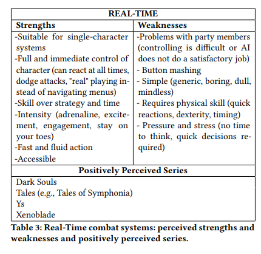
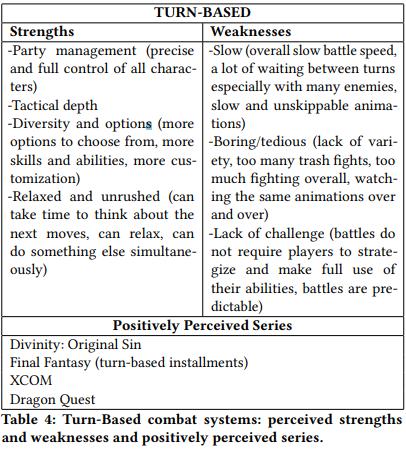
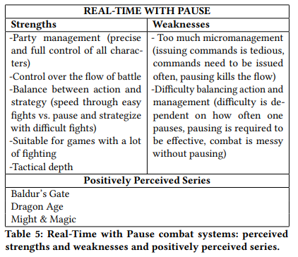
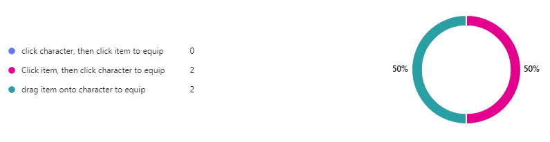
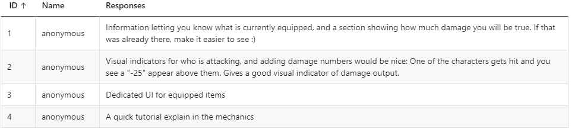
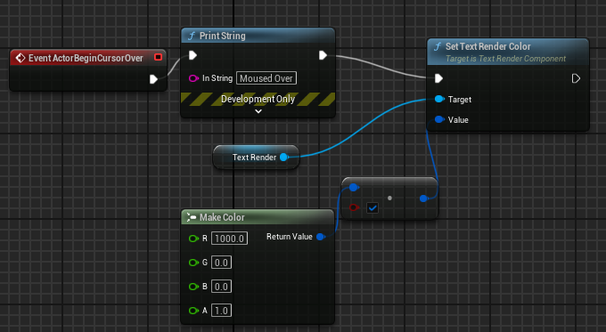
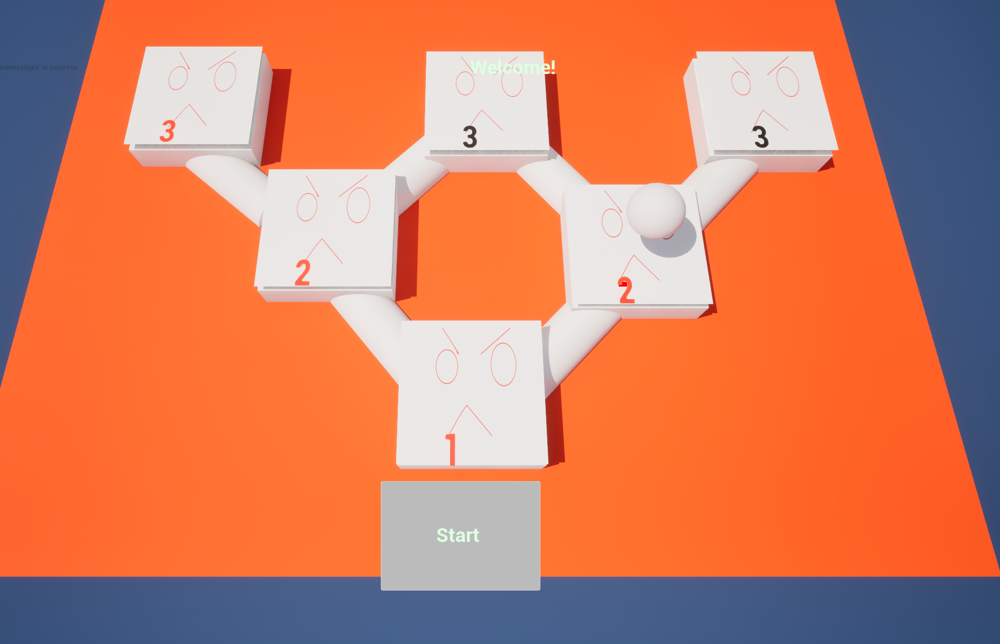
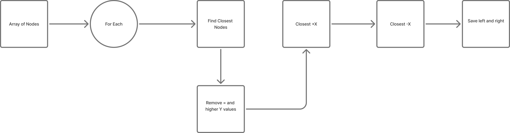
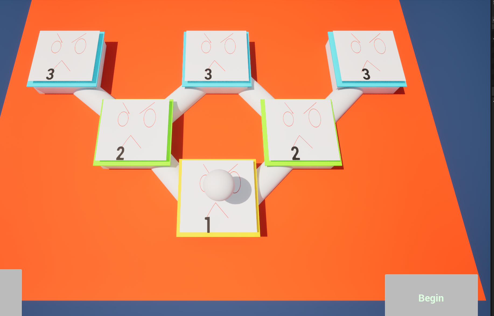

# 2204331 Ben Powell
# Ben Powell Project Commentary

### Planninng for term

 After using mostly blueprints for the prototype, i want to take the current state of the game and use it to practice C++ and specifcally Unreal C++, and as i already have things done in the project it will be easier than figuring it out from scratch. 

 To better figure out how to turn it from blueprints, to C++ i want to create a proper map of the workings of the project, so i can better see how the different parts and managers interact with each other. This will help me be able to fix or change things, and then also how to expand it from the current.

 I will use user feedback to inform my choices going from my prototype and see what people would or expect there to be in the game.

 I also want to try to use procedural generation to create a roguelike system, as i have not used it before. So there may be some issue making that work with the overall context of the game.

 I want to create a game that feels good for someone to play, where the choices of which item or choice they pick will be satisfying. And it will build over time to create powerful characters to defeat dangerous bosses.

## Project Outcome

## Research

### Battle Style

  
"The key characteristic of RT systems is that all, or almost all, of the gameplay takes place in real-time."

  
"combatants act in turns, usually one at a time. Other combatants are typically unable
to move or perform actions outside of their own turn"
  

  

From the evaluation made by this paper, using infomation gathered from forum posts to generate overall opinions on the strengths and weaknesses of the different battle styles. Real time seems to point towards single character, intense action and being problematic having multiple party members. Also as there is no direct control while the combat is going, having real time actions do not make sense.
Real time with pause is a possible idea, as it allows party management and tactical depth. However it also does not really gain from being real time with the features planned. 
Turn based does have some issues with it being possibly boring or tedious due to the same animations being played over and over. Also some turn based games can be predictable if there is an obivious un-changing order to the combat. With 

## UI

## Initial User feedback

### Results

Big part was UI and not knowing what the attack value was.

<iframe src="https://blueprintue.com/render/ygfjkdp-/" scrolling="yes" allowfullscreen></iframe>

From the questionaire, the main consensus is selecting the item first, and then the character wanting to be equipped. 
Dragging the item is also a popular way of equipping the items, and it gives a good visual of actually 'equipping' the items. This will help with the confusion felt by the testers on, what order they need to click things and what characters are being equipped.
Having effects and visuals will help show whats going on a provide a feedback effect to the player on what they're doing. 
The super auto pet; shop and item drag mechanic, creates a clear and easy to tell way of selecting an item, and then showing the selecting of the character to add the item to. The item having clear details on what it does and how much it is. 

The clear details on what things do really makes it easier to play smoothly in Super Auto Pet's. Form the feedback, knowing what is equipped and how that is affecting the character, as well as seeing the stat values of the characters easily is something that is important.

## Tree Structure Research

## wave function collapse 

## Implementation

### Process

Created structure diagram of the program to better see what each part did, and to easier build from it.

Adding way to see what character is selected.
When selecting a character it will now show what character has been selected.
creating a sphere to show selcected as a place holder for a better looking effect. It starts invisible and an event dispatch triggers an event in the selected hero that makes it visible, until the next selection of a hero where it sets it back to invisible.

To make it clearer i want an aura or some visual signifyier that its been selected.
Also an outline when hovering the characters to show its selectable.

Creating the map/ progression

using a data table to create bounds, with a difficulty number to use to generate enemies for levels of encounter.
I will then create a map, and populate each node with a different enemy encounter. Using a function library to read the rows, and then functions with the map actor to get those ranges and get the random numbers.
However using random numbers, to create a runtime, random in future layout, i will have to change how my previous enemy loading works as from what i could see online, data tables cannot be edited during runtime, so i cant then save my create enemies into a data table to be read easily with my current system. Apparently there are packages on the store that enable this, but im not sure how worth it would be to use this, rather than just re do it, which could probably help with readability and make it more efficient.

https://www.fab.com/listings/5c77947a-5096-438f-91fb-a28729a34b57
Possible?
https://forums.unrealengine.com/t/load-csv-data-table-in-runtime-builds/414548/4
https://blueprintue.com/blueprint/8zkq31hh/
https://forums.unrealengine.com/t/set-data-table-row/85844/7

Redoing the enemy set up, to use the created enemies rather than the set enemy data in the table. 

because i used a function library, it means as long as i handle the inputs in the same way, i can just change the function to fit with the new array, and there isnt alot of logic to change.
<iframe src="https://blueprintue.com/blueprint/fvsuyzz1/" scrolling="yes" allowfullscreen></iframe>

<iframe src="https://blueprintue.com/blueprint/7hzjewmd/" scrolling="yes" allowfullscreen></iframe>

While realising i may need to redo some parts which is fine, upon reflection on the project, I felt a bit lost on the steps i need to take to make the game better/ good, from what i currently have. I want to properly go through and break down the steps i need to take to make the parts, so i can more easily work on it.
I do have a concern that alot of the games like this, where you have roguelike progression and battles like i want, have good artstyles that make it fun or gimicky, and as i dont have the best art ability, my mechanics will not fill the gap with the current plan. 
After talking through it i realised i did not have as big an issue than i thought i did.
Also that using an array to store the enemies is a correct idea, as it works similar to a hash table being used to save a row of a large data table in a game that would need it.
And it shouldn't be that difficult to change what i have to work with an array of structs rather than the structs from a data table.

As the map will have a different camera, i will need to have it move from the main view to the map view. This will go into the menuManager, it will need to happen at the start of the game, and then back to the map view after a fight has happened.

Thought that the text would look strange if not pointing at the player camera. So i want to add a material for the text that will point to the camera. I will have to test to see if it does give a better view than flat text.
https://forums.unrealengine.com/t/tetx-billboard/274961/2
(Tetx billboard? - Programming & Scripting / Blueprint, 2022)
Tetx billboard? - Programming & Scripting / Blueprint (2022) At: https://forums.unrealengine.com/t/tetx-billboard/274961 (Accessed  24/03/2025).

Add a variable to store the location above the nodes for the player icon to move to.
Added Enter Input, but it would not trigger in runtime.
I then realised i had not been using the correct left click line trace, and the debug message i had been using was from a different left click. and had been using on clicked instead of left click.

<iframe src="https://blueprintue.com/blueprint/zl_wx1nv/" scrolling="yes" allowfullscreen></iframe>

Im trying to get the clicked on node, and save it. But i feel like i have overcomplicated it by using child actors on one actor, as im struggling to find the way to select the correct node to have the move to. 

To test whether i could have indiivudal nodes do things and it wasnt some strange issue, i added a on mouse overlap event to test if that worked for the node. I had to change the visibilty and collision of the node to make it work.

I couldn't get it to save the correct location and BP node. So im attempting to use event dispatchers.
Although having multiple of the same actor that could dispatch the same event makes it difficult to figure out how to set it properly.

Perhaps using a interface could help with it. 

Upon using a interface that takes the input from the node when its clicked, which is sent to BP_Map and used in a lerp mover that would move between the different nodes smoothly.

<iframe src="https://blueprintue.com/blueprint/xbd657-f/" scrolling="yes" allowfullscreen></iframe>

The Node selected event is an interface event which is called when a node's actoronclicked event is called and inputs the node's "location above" to lerp to the player icon to the clicked node.
Using the interface makes it easier to connect mutltiple of the same node logic to logic on the map. An event dispatcher or other methods might have worked to do the same thing, but this was the simpler way to do it without extra steps.

Now i need to populate the nodes, and have it load the encounter that has been generated. 
The BP_nodes were child actor components and they wouldn't cast into the array as BP_Nodes.
Found on this webstie https://forums.unrealengine.com/t/blueprint-does-not-inherit-from-child-actor-component-cast-to-would-always-fail/555398 That i need to use "Get Child actor".
<iframe src="https://blueprintue.com/render/n1pg-0oe/" scrolling="no" allowfullscreen></iframe>]

With this part a good start, i now need to make sure it loads the encounter properly and the previous stuff still works.
One thing with using a left click event in the map, makes the other left click not work. 
https://www.reddit.com/r/unrealengine/comments/1eh17iv/if_i_want_the_left_mouse_click_to_do_multiple/
This website suggets using Input mapping contexts. Which looks to be the more up to date version of using inputs. If there was alot more specific inputting going forwards, or alot more 'sections' that it could be used for, redoing the input doesnt seem worth for what it fixes.
Instead im going to use checks and either interfaces or event dispatches, and depending on what menu is up, do a specific action.
After further investigation, i realised, as i was using an onclicked, i did not need the other left click events. And thus not needing any extra checks.

I want to store a reference to the map from the battle manager, so it can more easily access the array with the enemy info.
The battle logic was not working correctly and after going through parts and figuring out where the logic path stopped, i realised that as the map view was now the starting palyer pawn, rather than the mainview. To fix this i will make it instance editable, and set it specifically in the editor, as there are only one instance of each.

Now i need to have it so it will go back to the selection screen after a battle has happened. And then have the selection be counted.

Using this as a plan for how to get the different actors to look through.
I created a outline of the logic in my Constructing the tree function. It got all actors of class, and saved it in an array. It removes itself from the array incase that could cause an issue. It then goes through each one and gets the location of the indexed and the position of self, and removes it if it has a lower Y value. Turns out the ones behind are actually higher Y values so i needed to swap that around. 

I then need to get a left and right actor, using the same methods of comparing each one, however using the new array gained from removing behind ones. I also foresaw an issue where the if a node didnt have a right or left it would cause an error. I add an isvalid check for changing the materials.

It wasnt working completely. One of the logics in the comparisons were probably wrong, to go through it systematically i will change round less than/greater than to see what it affects.

One thing i had forgot, that could be causing issues, is that the Nodes are all child actors on the Map actor, so using actual location may not be the best thing to do. From querying this to chatGPT, it seems that using the parent actor to do all the logic is a better thign to do, as it will use the correct locations.
This means i will have to change it to getting get all components rather than actors.
<iframe src="https://blueprintue.com/render/fcwh048q/" scrolling="no" allowfullscreen></iframe>

This is what it looks did look like, but from what ive queried to ChatGPT about the best way of doing it, theres an easier way of finding it, as well as better doing it within the map rather than the nodes themselves.
 

Found out that the dead event would trigger before the game, because the enemies health check would trigger before the enemies stats would be allocated, so putting it at the start of the set up list makes it work.
Begs the question on what parts of the set up on the battle manager is worth it being on begin play compared to having more set up actions be in the construct script instead.
This actually didn't fix anything, just meant it would try and trigger before 

Scan current pos, make possible ones children. 

## Wave function generation of the map tree.

Viewing each encounter as a 'tile' within the context of a WFC. 
Using my preexisting data table of different difficulty encounters, i can use them to create each node within the wfc.
This involves using a for loop to create child actor components. Because im using child actor, i need to use the get child actor.
https://forums.unrealengine.com/t/blueprint-does-not-inherit-from-child-actor-component-cast-to-would-always-fail/555398

Plan for finsihs 

https://www.youtube.com/watch?v=ZFA3uCg_Peg

For next week
- Read Design pattern: Tree and other data structure sections.
- start essential Scrum
- Go outside
- Research wave function collapse, use that for the nodes stuff instead of manually creating tree
- More Sololearn, github certifiation and AWS
- Using monster difficulties, and other events to populate wave function.
- Guest speakers - management person

https://ucreative.summon.serialssolutions.com/search?s.q=Mike+mcgrath#!/search/document?pn=1&ho=t&include.ft.matches=f&l=en&q=design%20patterns%20elements%20of%20reusable%20object&id=FETCHMERGED-ucreative_catalog_8888592